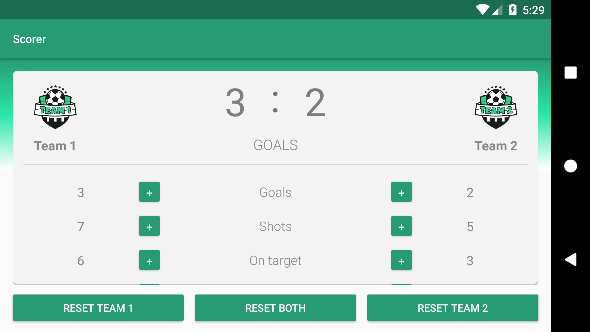

# Scorer
Hello and welcome to the second project that I had to do for Google Android Basics Challenge.

# Instructions
For the people who are new to github, if you want to access or see:
- activity_main.xml, go to: Scorer/app/src/main/res/layout/
- MainActivity.java, go to: Scorer/app/src/main/java/com/example/android/scorer/
- drawable folder, go to: Scorer/app/src/main/res/

# Screenshots
- Portrait mode

- Landscape mode

